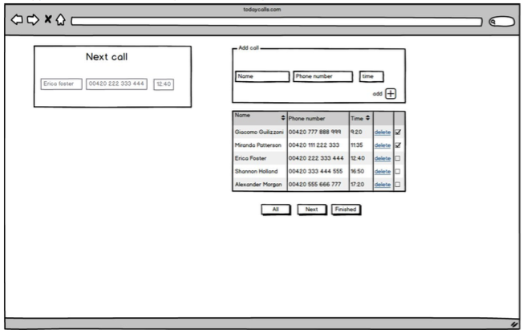

# calls
Unicorn Systems' homework assignment

Build application for creating TODO list of calls.  
You should create simple application to create todo-list of today's calls. Application consists of just one page and there is no need for some middleware or backend. You can use any Javascript frameworks and libraries (MVC frameworks preferred) you like. Application should store all of it's data in the local storage. Graphical design is up to the programmer. While some CSS framework can be used, JavaScript quality is the most important. Ideally you should also write documentation and some tests for the application.  
For application behaviour and description see the following:

### Add call
Section to add new call. It consists of these inputs:
* name ­(max 30 characters)
* phone number ­(*see phone number validation below*)
Phone number validation ­- each phone number should start with '+' or '00' string followed by digits or characters '(', ')', '­'. You should ignore all whitespaces when storing the record and convert '+' to '00' (there should be just one format to display phone number). Characters '(',')' and '­' can be used just once and should be just on position 2 to 8 in the string.
Example of valid phone numbers:
* +(420) 111 222 333
* +(420)­111222333
* +420111222333
* 00420111222333
Stored and display format of phone number -­ 00XXX XXX XXX
* time ­(mm:ss)
Store all data to the local storage.

### List of calls
Display list of calls stored by user as shown in wireframe.
Header consists of name (sortable), phone number, time (sortable).
Each row consists of these columns:
* name
* phone number
* time
* delete action (deletes this record from the storage)
* checkbox (disabled; checked if the time of call < current time)
Default sort of list is by time ASC. User can sort by name and time.
Below the table are 3 buttons
* all -­ display all records in list
* next ­- display just calls in future
* finished -­ display just calls in past

### Next call
This section should show to the user the next call of the day.
In the ordered list of calls (by time ASC) find first record where time of call > current time and display that record.